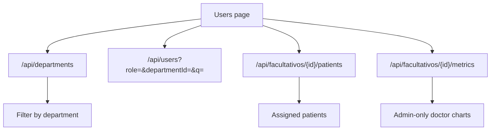

# Radix API reference

This reference reflects the current Spring Boot controllers under the `/v2`
context path. Add the environment base URL before each path, for example
`https://api.raddix.pro/v2` or `http://localhost:8080/v2`.

## Health and metadata

These endpoints expose operational metadata and generated documentation.

| Method | Path | Description |
|--------|------|-------------|
| `GET` | `/` | Returns API status and metadata. |
| `GET` | `/actuator/health` | Returns Spring Actuator health. |
| `GET` | `/docs` | Returns generated API documentation. |

## Authentication

Authentication is currently mock-oriented. The API returns user IDs or the
hardcoded admin token as bearer-like tokens.

| Method | Path | Description |
|--------|------|-------------|
| `POST` | `/api/auth/token` | Exchanges OAuth client credentials for a token. |
| `POST` | `/api/auth/login` | Logs in with email and password. |
| `POST` | `/api/auth/register/doctor` | Registers a doctor from an admin context. |
| `POST` | `/api/auth/register/patient` | Registers a patient from a doctor context. |

## Users and facultativos

Users are the source of truth for `DESARROLLADOR`, `ADMIN`, and `FACULTATIVO`
identities. The frontend no longer has a separate Facultativos page; it manages
clinical staff from the Users page.

| Method | Path | Description |
|--------|------|-------------|
| `GET` | `/api/users` | Lists users. |
| `GET` | `/api/users/role/{role}` | Lists users by role. |
| `GET` | `/api/users/{id}` | Gets one user. |
| `PUT` | `/api/users/{id}` | Updates one user. |
| `DELETE` | `/api/users/{id}` | Deletes one user. |
| `GET` | `/api/doctors` | Lists clinical doctors/facultativos. |
| `GET` | `/api/doctors/{id}` | Gets one clinical doctor/facultativo. |
| `PUT` | `/api/doctors/{id}` | Updates one clinical doctor/facultativo. |

## Patients

Patient endpoints manage active patient records and their linked user account.

| Method | Path | Description |
|--------|------|-------------|
| `POST` | `/api/patients/register` | Registers a patient. |
| `GET` | `/api/patients/profile/{userId}` | Gets patient profile by user ID. |
| `GET` | `/api/patients/{id}` | Gets one patient. |
| `GET` | `/api/patients` | Lists active patients. |
| `PUT` | `/api/patients/{id}` | Updates one patient. |
| `DELETE` | `/api/patients/{id}` | Deletes or deactivates one patient. |

## Treatments

Treatment endpoints power the active treatment dashboard card and the treatment
detail pages.

| Method | Path | Description |
|--------|------|-------------|
| `GET` | `/api/treatments` | Lists treatments. |
| `GET` | `/api/treatments/active` | Lists active treatments. |
| `GET` | `/api/treatments/{id}` | Gets one treatment. |
| `GET` | `/api/treatments/patient/{patientId}` | Lists treatments by patient. |
| `POST` | `/api/treatments` | Creates a treatment. |
| `POST` | `/api/treatments/{id}/end` | Ends one treatment. |

## Alerts

Alert endpoints power the pending alert dashboard card and alert detail pages.

| Method | Path | Description |
|--------|------|-------------|
| `GET` | `/api/alerts` | Lists alerts. |
| `GET` | `/api/alerts/pending` | Lists pending alerts. |
| `GET` | `/api/alerts/patient/{patientId}` | Lists alerts by patient. |
| `PUT` | `/api/alerts/{id}/resolve` | Resolves one alert. |

## Metrics, watches, and supporting data

These endpoints support dashboards, patient detail screens, smartwatch
ingestion, settings, messages, isotope catalogs, units, and games.

| Method | Path | Description |
|--------|------|-------------|
| `GET` | `/api/dashboard/stats` | Gets dashboard summary stats. |
| `GET` | `/api/health-metrics/patient/{patientId}` | Lists patient health metrics. |
| `GET` | `/api/health-metrics/patient/{patientId}/latest` | Gets latest patient metrics. |
| `GET` | `/api/health-metrics/treatment/{treatmentId}` | Lists treatment health metrics. |
| `POST` | `/api/health-metrics` | Creates health metrics. |
| `GET` | `/api/health-logs/patient/{patientId}` | Lists patient health logs. |
| `GET` | `/api/radiation-logs/patient/{patientId}` | Lists patient radiation logs. |
| `GET` | `/api/radiation-logs/treatment/{treatmentId}` | Lists treatment radiation logs. |
| `POST` | `/api/watch/ingest` | Ingests raw watch data. |
| `GET` | `/api/watch/{imei}/metrics` | Gets watch metrics by IMEI. |
| `GET` | `/api/watch/patient/{patientId}/latest` | Gets latest watch metrics by patient. |
| `POST` | `/api/smartwatches` | Registers a smartwatch. |
| `GET` | `/api/smartwatches` | Lists smartwatches. |
| `GET` | `/api/smartwatches/{id}` | Gets one smartwatch. |
| `GET` | `/api/smartwatches/patient/{patientId}` | Lists smartwatches by patient. |
| `PUT` | `/api/smartwatches/{id}` | Updates one smartwatch. |
| `DELETE` | `/api/smartwatches/{id}` | Deletes one smartwatch. |
| `GET` | `/api/messages/patient/{patientId}` | Lists patient messages. |
| `POST` | `/api/messages` | Creates a message. |
| `PUT` | `/api/messages/{id}/read` | Marks one message as read. |
| `GET` | `/api/isotopes` | Lists isotopes. |
| `GET` | `/api/isotopes/{id}` | Gets one isotope. |
| `GET` | `/api/units` | Lists units. |
| `GET` | `/api/units/{id}` | Gets one unit. |
| `GET` | `/api/settings/patient/{patientId}` | Gets patient settings. |
| `PUT` | `/api/settings/patient/{patientId}` | Updates patient settings. |
| `GET` | `/api/games/patient/{patientId}` | Lists patient game sessions. |
| `POST` | `/api/games` | Creates a game session. |

## Missing endpoints

The current frontend needs these endpoints before mock data can be removed from
the Users page.

| Method | Path | Purpose |
|--------|------|---------|
| `GET` | `/api/departments` | Lists departments. |
| `POST` | `/api/departments` | Creates a department. |
| `PUT` | `/api/departments/{id}` | Updates a department. |
| `GET` | `/api/users?role=&departmentId=&q=` | Lists users with server-side filters. |
| `PATCH` | `/api/users/{id}/role` | Updates a user role. |
| `PATCH` | `/api/users/{id}/department` | Assigns a department to a user. |
| `GET` | `/api/facultativos` | Lists admin and facultativo clinical staff. |
| `GET` | `/api/facultativos/{id}/patients` | Lists assigned patients. |
| `PUT` | `/api/facultativos/{id}/patients` | Replaces patient assignments. |
| `GET` | `/api/facultativos/{id}/metrics` | Gets one facultativo metric set. |
| `GET` | `/api/facultativos/metrics?departmentId=` | Gets aggregate metrics by department. |
